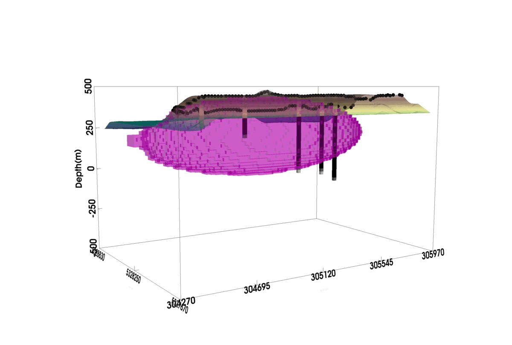

# Stochastic modeling of geological geometry features
**[Summary](#summary) | [Features](#features) | [Usage](#usage) | [Citations](#citations) | [Issues](#issues)**

## Summary

**Plain language summary:**

Understanding the shape and geometry of the subsurface structures is very important in geosciences. Various data sources have been employed to infer the geometric features of geological units. The framework developed in our study allows to include drawings of geological diagrams, which represent expert knowledge, into stochastic simulations. The constructed 3D models are aligned with geological diagram, drillhole data, outcrop contacts, and geophysics. We quantify the uncertainty of geometric characteristics for constructed models.

**Authors:**

Xiaolong Wei (xwei2@stanford.edu)

David Zhen Yin (yinzhen@stanford.edu)

Wilson Bonner (wilson.bonner@koboldmetals.com)

Lijing Wang(lijing.wang@uconn.edu)

Jef Caers (jcaers@stanford.edu)

**Acknowledgments:**

[KoBold Metals](https://www.koboldmetals.com/)

[Rio Tinto](https://www.riotinto.com/)

 

## Features

This package has the following features:

- Perform 2D/3D level-set Monte Carlo sampling to construct geological models
- Construct models constrained by drillholes, outcrop contacts, and geological diagrams
- Impose constraints individually or jointly
- Quantify uncertainty of the constructed models
- Simulate gravity and magnetic data for the constructed models using (ongoing)
- Falsify geological hypotheses (ongoing)

## Usage

To run the package locally, you need to have python installed, followed by the installation of dependencies:

    pip install -r requirements.txt

Please refer to the provided [examples](https://github.com/xiaolongw1223/Knowledge-driven-stochastic-modeling/tree/main/examples) for more details.

## Citations

If you are using the package, please cite:

[1] Wei, X., Yin, Z., Bonner, W. and Caers, J., 2024. Knowledge-driven stochastic modeling of geological geometry features conditioned on drillholes and outcrop contacts. Computers & Geosciences, p.105779.

    @article{wei2024knowledge,
      title={Knowledge-driven stochastic modeling of geological geometry features conditioned on drillholes and outcrop contacts},
      author={Wei, Xiaolong and Yin, Zhen and Bonner, Wilson and Caers, Jef},
      journal={Computers \& Geosciences},
      pages={105779},
      year={2024},
      publisher={Elsevier}
    }

[2] Wei, X., Yin, Z. and Caers, J., 2024, August. Falsification of magmatic intrusion models using outcrops, drillholes, and geophysics. In International Workshop on Gravity, Electrical & Magnetic Methods and Their Applications, Shenzhen, China, May 19–22, 2024 (pp. 364-367). Society of Exploration Geophysicists and Chinese Geophysical Society.
  
    @inproceedings{wei2024falsification,
      title={Falsification of magmatic intrusion models using outcrops, drillholes, and geophysics},
      author={Wei, Xiaolong and Yin, Zhen and Caers, Jef},
      booktitle={International Workshop on Gravity, Electrical \& Magnetic Methods and Their Applications, Shenzhen, China, May 19--22, 2024},
      pages={364--367},
      year={2024},
      organization={Society of Exploration Geophysicists and Chinese Geophysical Society}
    }

[3] Wang, L., Peeters, L., MacKie, E.J., Yin, Z. and Caers, J., 2023. Unraveling the uncertainty of geological interfaces through data-knowledge-driven trend surface analysis. Computers & Geosciences, 178, p.105419.

    @article{wang2023unraveling,
      title={Unraveling the uncertainty of geological interfaces through data-knowledge-driven trend surface analysis},
      author={Wang, Lijing and Peeters, Luk and MacKie, Emma J and Yin, Zhen and Caers, Jef},
      journal={Computers \& Geosciences},
      volume={178},
      pages={105419},
      year={2023},
      publisher={Elsevier}
    }

## Issues

Please [make an issue](https://github.com/xiaolongw1223/Knowledge-driven-stochastic-modeling/issues) if you encounter any problems while trying to run the notebooks.

Or contact Xiaolong Wei directly via email.
