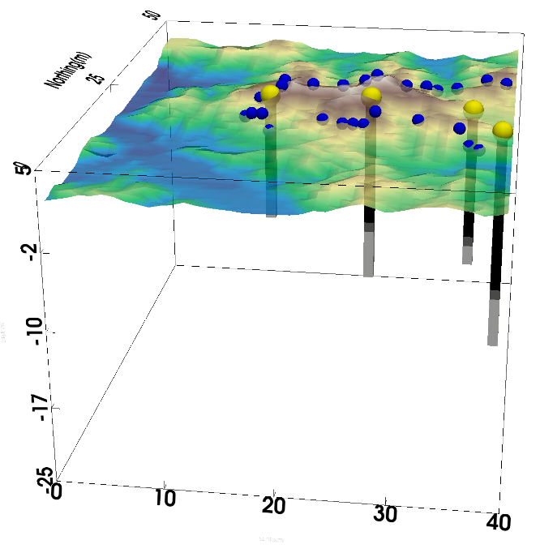

# Tutorials

## Research problem formulation

Given a set of drillholes and outcrop contacts, how 

## Research problem formulation

Given a set of drillholes and outcrop contacts, how 

## Case 1: 3D stochastic modeling constrained by drillholes

**Input files**

**Results**

## Case 2: 3D stochastic modeling constrained by drillholes and outcrops

## Case 3: 2D stochastic modeling constrained by drillholes and a geological sketch
