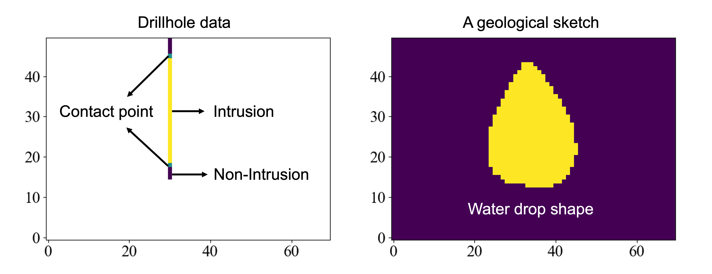
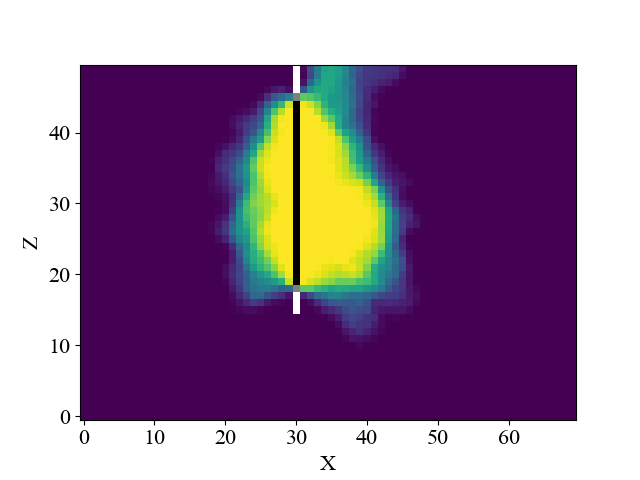

# Tutorial Examples

## TOC
- [Research problem formulation](#research-problem-formulation)
- [Case 1: 3D stochastic modeling constrained by drillholes](#case-1-3d-stochastic-modeling-constrained-by-drillholes)
- [Case 2: 3D stochastic modeling constrained by drillholes and outcrops](#case-2-3d-stochastic-modeling-constrained-by-drillholes-and-outcrops)
- [Case 3: 2D stochastic modeling constrained by drillholes and a geological sketch](#case-3-2d-stochastic-modeling-constrained-by-drillholes-and-a-geological-sketch)

## Research problem formulation

How can subsurface models be constructed using drillholes, outcrop contacts, and airborne geophysics? 

How can experts' geological knowledge be incorporated into the modeling process?

How to quantify the uncertainty of constructed models?

Can constructed models help make informed decisions for subsequent exploratory actions (e.g., where to drill or to collect more geophysical data)?

Animation caption: The dark red bars represent the drillholes whose locations are marked by yellow balls. Black dots indicate the outcrop contacts and the colorful lines represent the survey lines of airborne geophysics. All these data sets will be incorporated into a stochastic modeling process. The field data cannot be shared, so we created realistic synthetic data used in the tutorials.

## Case 1: 3D stochastic modeling constrained by drillholes

**Data overview**

The figure on the right shows the drillholes, outcrop contacts and topography used in Case 1 and 2.

**Input files**

- "drillholes.txt": lithological information from drillholes where 1, 0, and 0.5 indicate the intrusion, non-intrusion, and contact points, respectively.

- "ind_active.txt": bool type file contains topography information, where 1 and 0 correspond to the subsurface and air (above the surface).

- "initial_model.txt": starting model used in Monte Carlo sampling, which is a ranomly generated ellipsoid.

- "mesh.txt": 3D discretization information

**Results**

The model files exceed the size limit for GitHub, so please download the package and reproduce the results locally. Here we provide a quick example. The mean and standard deviation models shown below demonstrate the goodness of fit with the drillhole. However, the resulting models cannot match with outcrop contacts ([Wei et al., 2024](https://library.seg.org/doi/abs/10.1190/GEM2024-091.1)). We thus impose both drillholes and outcrops serving as constraints in Case 2. 

## Case 2: 3D stochastic modeling constrained by drillholes and outcrops

**Data overview**

The data is the same as in Case 1.

**Input files**

We only clarify the files that differ from Case 1.

- "drillholes_coordinate.txt": X and Y location of drillholes, used for visualization only, not involved in the modeling.

- "outcrops.txt": lithological information from surface outcrop contacts where 1, 0, and 0.5 indicate the intrusion, non-intrusion, and contact points, respectively.

**Results**

The mean model aligns with the outcrops after 1000 sampling steps. More sampling steps will result in a better match ([Wei et al., 2024](https://library.seg.org/doi/abs/10.1190/GEM2024-091.1)).

## Case 3: 2D stochastic modeling constrained by drillholes and a geological sketch

**Data overview**

We aim to stochastically construct models that align with the drillhole and a geological sketch. The geological sketch can be obtained from literature or consultations with experts. 

**Input files**

- "drillhole_vertical.txt": a 2D array with drillhole information where 1, 0, and 0.5 indicate the intrusion, non-intrusion, and contact points, respectively.

- "initial_model.txt": starting model used in Monte Carlo sampling, which is a ranomly generated ellipse.

- "sketch.txt": a 2D binary geological sketch.

**Results**

The mean model aligns with the drillhole and the water drop shaped geological sketch after 1000 sampling steps. The technical details can be found in [Wei et al., 2024](under review)

